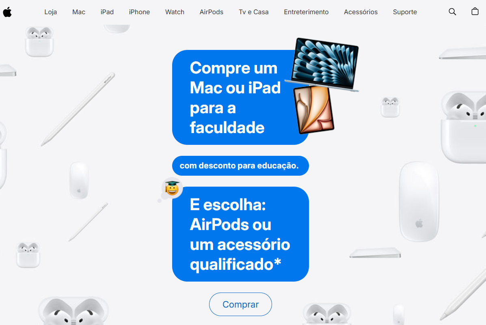

# Projeto - Clone da Apple
Esse projeto é um clone da página inicial e de descontos para educação da Apple.
Esse projeto não tem nenhum fim lucrativo, apenas educacional.
* Tecnologias utilizadas: HTML5, CSS3 e JavaScript ES6+.

[Link para a página inicial.](https://andressatomiozzo.github.io/clone-apple/)
[Link para a página de descontos para educação.](https://andressatomiozzo.github.io/clone-apple/estudos.html)

